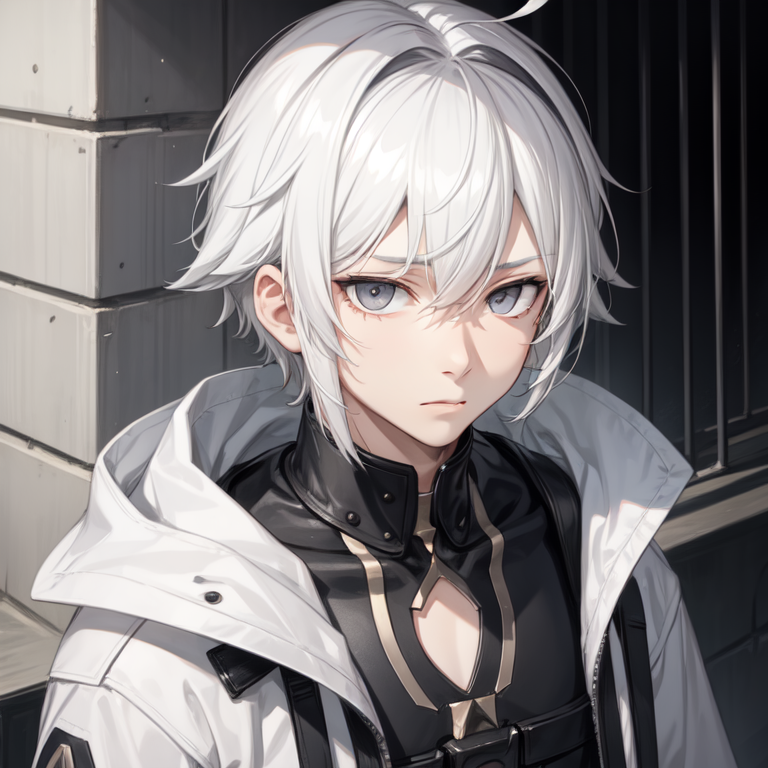

# Learning-to-markdown
# Headers (Заголовки)
# Header 1 (#)
## Header 2 (##)
### Header 3 (###)
#### Header 4 (####)
___
# Text styles (Стили текста)
**bold** (** **)

*italic* (* *)

***text*** (*** ***)

_italic2_ (_ _)

__bold2__ (__ __)

___text2___ (___ ___)

~~Crossed~~ (~~~~)

***~~All In One~~***
___
* text (*)
  * text 2 (..*)
    * text 3 (....*)
- text (-)
  - text 2 (..-)
    - text 3 (....-)
+ text (+)
  + text 2 (..+)
    + text 3 (....+)
___
1. text (1. )
    1. text 2 (....1. )
        1. text 3 (........1. )
2. text (2. )
___
# Tasks (Задания)
* [ ] text (*/-/+/1... [ ] txt)
* [x] text (*/-/+/1... [x] txt)
# Emojis (Эмоции) & Links (Ссылки)
https://github.com/GnuriaN/format-README/blob/master/emoji.md

[**LINK** To Emojis](https://github.com/GnuriaN/format-README/blob/master/emoji.md)
```txt
[text](url)
```

# Quotes (Цытаты)
> 1 lvl (> )
>> 2 lvl (>> )
>>> 3 lvl (>>> )
>>>> 4 lvl (>>>> )
___
# Code (Код)
A text string containing `code` inside (``)

Текстовая строка внутри которой расположен `код`  (``)

```python
def plus(*args: int) -> int:
    result = 0
    for item in args:
        result += item
    return result
```

```txt
(
    ```...
    ...
    ```
)
```
___
# Images (Картинки)

```txt

```
___
## Pop-up text on the image (Всплывающий текст на картинке)

```txt

```
## Gif

```txt

```
## Video
[](https://www.youtube.com/watch?v=NXNf9aYTCZ0)
```txt
[](video)
```
___
# Tables (Таблицы)
| LEFT | CENTER | RIGHT |
|:----------|:-----:|----------:|
| left text | Center text | Right text |

```txt
  | LEFT | CENTER | RIGHT |
  |:----------|:-----:|----------:|
  | left text | Center text | Right text |
```
